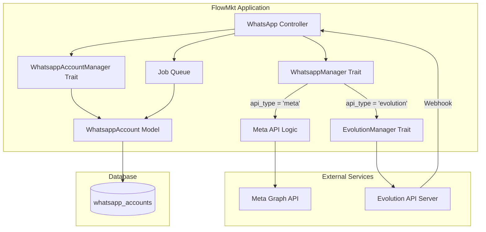
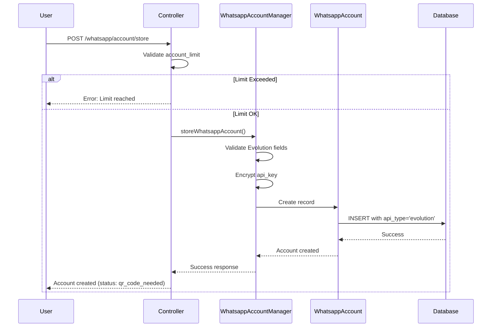
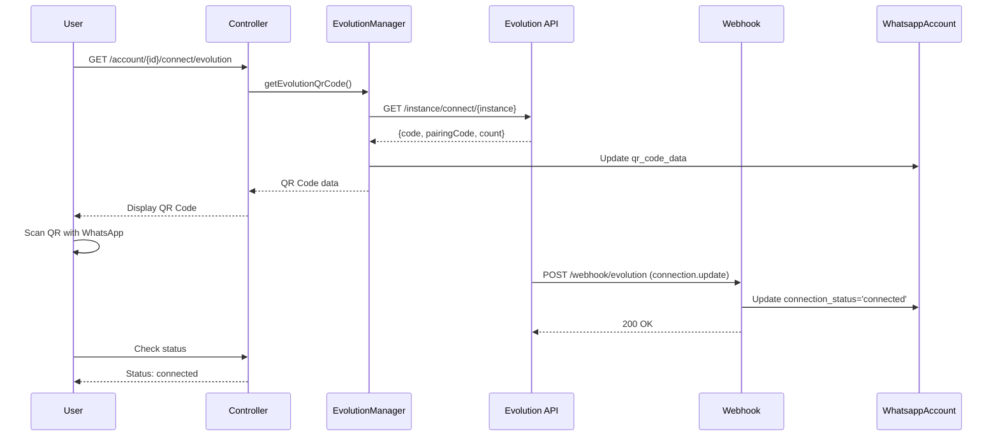
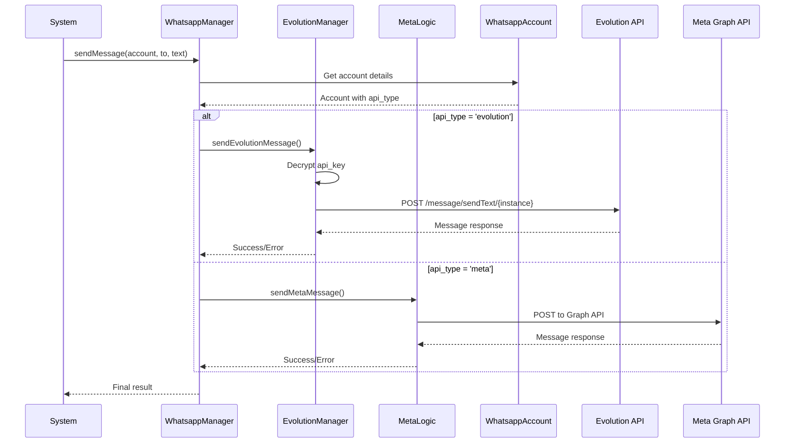

# Documento de Design - Integração Evolution API

## Overview

Este documento descreve a arquitetura e implementação técnica para integrar a Evolution API como alternativa paralela à Meta API no FlowMkt. A solução utiliza o padrão Strategy para roteamento de mensagens, mantendo separação clara entre as duas implementações de API.

A Evolution API é uma solução open-source baseada na biblioteca Baileys que permite comunicação com WhatsApp através do protocolo WhatsApp Web. Diferente da Meta API oficial, ela não requer aprovação formal da Meta e oferece custos operacionais significativamente menores.

### Principais Decisões de Design

1. **Padrão Strategy para Roteamento**: Implementação de roteamento baseado em `api_type` permite adicionar novos provedores de API no futuro sem modificar código existente
2. **Traits Separados**: `EvolutionManager` e lógica Meta API mantidos em traits distintos para isolamento e manutenibilidade
3. **Controle Unificado de Limites**: `account_limit` aplica-se a todas as contas independentemente do tipo, simplificando lógica de negócio
4. **Criptografia de Credenciais**: Uso do sistema de criptografia nativo do Laravel para proteger `api_key`
5. **Webhooks Assíncronos**: Processamento de eventos via jobs para evitar timeouts e melhorar performance

### Referências Técnicas

- [Evolution API Documentation](https://doc.evolution-api.com/)
- [Evolution API GitHub Repository](https://github.com/EvolutionAPI/evolution-api)
- Laravel 10.x Documentation (assumindo versão atual do FlowMkt)

## Architecture

### Visão Geral da Arquitetura



### Fluxo de Criação de Conta Evolution



### Fluxo de Conexão via QR Code



### Fluxo de Envio de Mensagem



## Components and Interfaces

### 1. EvolutionManager Trait

**Localização**: `core/app/Traits/EvolutionManager.php`

**Responsabilidade**: Encapsular toda comunicação HTTP com a Evolution API

**Métodos Públicos**:

```php
trait EvolutionManager
{
    /**
     * Envia mensagem de texto via Evolution API
     * 
     * @param WhatsappAccount $account Conta Evolution configurada
     * @param string $to Número do destinatário (formato: 5511999999999)
     * @param string $messageText Texto da mensagem
     * @param array $options Opções adicionais (delay, linkPreview, etc)
     * @return array ['success' => bool, 'data' => array, 'error' => string|null]
     */
    protected function sendEvolutionMessage(
        WhatsappAccount $account, 
        string $to, 
        string $messageText,
        array $options = []
    ): array;

    /**
     * Solicita QR Code para conexão da instância
     * 
     * @param WhatsappAccount $account Conta Evolution
     * @return array ['success' => bool, 'code' => string, 'pairingCode' => string, 'error' => string|null]
     */
    protected function getEvolutionQrCode(WhatsappAccount $account): array;

    /**
     * Verifica status de conexão da instância
     * 
     * @param WhatsappAccount $account Conta Evolution
     * @return array ['success' => bool, 'status' => string, 'error' => string|null]
     */
    protected function checkEvolutionStatus(WhatsappAccount $account): array;

    /**
     * Desconecta instância do WhatsApp
     * 
     * @param WhatsappAccount $account Conta Evolution
     * @return array ['success' => bool, 'error' => string|null]
     */
    protected function disconnectEvolutionInstance(WhatsappAccount $account): array;

    /**
     * Configura webhook para a instância
     * 
     * @param WhatsappAccount $account Conta Evolution
     * @param string $webhookUrl URL do webhook
     * @return array ['success' => bool, 'error' => string|null]
     */
    protected function setEvolutionWebhook(WhatsappAccount $account, string $webhookUrl): array;
}
```

**Dependências**:
- `Illuminate\Support\Facades\Http` para requisições HTTP
- `Illuminate\Support\Facades\Log` para logging
- `Illuminate\Support\Facades\Crypt` para descriptografia de api_key

**Tratamento de Erros**:
- Timeout de requisição: 30 segundos
- Retry automático: 3 tentativas com backoff exponencial (1s, 2s, 4s)
- Logging de todas as requisições e respostas com contexto completo

### 2. WhatsappManager Trait (Modificado)

**Localização**: `core/app/Traits/WhatsappManager.php`

**Modificações Necessárias**:

```php
trait WhatsappManager
{
    use EvolutionManager;

    /**
     * Envia mensagem de boas-vindas (modificado para suportar roteamento)
     */
    protected function sendWelcomeMessage(WhatsappAccount $whatsappAccount, string $to): array
    {
        $messageText = "Bem-vindo ao FlowMkt!";
        
        // Strategy Pattern: roteamento baseado em api_type
        return match($whatsappAccount->api_type) {
            'evolution' => $this->sendEvolutionMessage($whatsappAccount, $to, $messageText),
            'meta' => $this->sendMetaWelcomeMessage($whatsappAccount, $to, $messageText),
            default => ['success' => false, 'error' => 'Tipo de API não suportado']
        };
    }

    /**
     * Envia mensagem de teste (modificado para suportar roteamento)
     */
    protected function sendTestMessage(WhatsappAccount $whatsappAccount, string $to, string $message): array
    {
        return match($whatsappAccount->api_type) {
            'evolution' => $this->sendEvolutionMessage($whatsappAccount, $to, $message),
            'meta' => $this->sendMetaTestMessage($whatsappAccount, $to, $message),
            default => ['success' => false, 'error' => 'Tipo de API não suportado']
        };
    }

    // Métodos existentes da Meta API permanecem inalterados
    protected function sendMetaWelcomeMessage(...) { /* código existente */ }
    protected function sendMetaTestMessage(...) { /* código existente */ }
}
```

### 3. WhatsappAccountManager Trait (Modificado)

**Localização**: `core/app/Traits/WhatsappAccountManager.php`

**Modificações Necessárias**:

```php
trait WhatsappAccountManager
{
    use EvolutionManager;

    /**
     * Armazena nova conta WhatsApp (modificado para suportar Evolution)
     */
    protected function storeWhatsappAccount(Request $request): JsonResponse
    {
        // Validação de limite unificado
        $currentCount = auth()->user()->whatsappAccounts()->count();
        $accountLimit = auth()->user()->plan->account_limit;
        
        if ($currentCount >= $accountLimit) {
            return response()->json([
                'success' => false,
                'message' => 'Limite de contas atingido para seu plano'
            ], 403);
        }

        // Validação condicional baseada em api_type
        $rules = [
            'api_type' => 'required|in:meta,evolution',
        ];

        if ($request->api_type === 'evolution') {
            $rules = array_merge($rules, [
                'instance_id' => 'required|string|max:255',
                'api_url' => 'required|url|max:255',
                'api_key' => 'required|string|max:255',
            ]);
        } else {
            // Regras existentes para Meta API
            $rules = array_merge($rules, [
                'phone_number_id' => 'required|string',
                'access_token' => 'required|string',
                // ... outras regras Meta
            ]);
        }

        $validated = $request->validate($rules);

        // Criação da conta
        $account = new WhatsappAccount();
        $account->user_id = auth()->id();
        $account->api_type = $validated['api_type'];

        if ($validated['api_type'] === 'evolution') {
            $account->instance_id = $validated['instance_id'];
            $account->api_url = $validated['api_url'];
            $account->api_key = Crypt::encryptString($validated['api_key']);
            $account->connection_status = 'qr_code_needed';
        } else {
            // Lógica existente para Meta API
            $account->phone_number_id = $validated['phone_number_id'];
            // ... outros campos Meta
        }

        $account->save();

        return response()->json([
            'success' => true,
            'account' => $account,
            'message' => 'Conta criada com sucesso'
        ], 201);
    }

    /**
     * Inicia conexão de conta Evolution (novo método)
     */
    protected function connectEvolutionAccount(Request $request, WhatsappAccount $account): JsonResponse
    {
        if ($account->api_type !== 'evolution') {
            return response()->json([
                'success' => false,
                'message' => 'Esta conta não é do tipo Evolution'
            ], 400);
        }

        $result = $this->getEvolutionQrCode($account);

        if ($result['success']) {
            $account->qr_code_data = $result['code'];
            $account->save();

            return response()->json([
                'success' => true,
                'qr_code' => $result['code'],
                'pairing_code' => $result['pairingCode']
            ]);
        }

        return response()->json([
            'success' => false,
            'message' => $result['error']
        ], 500);
    }

    /**
     * Verifica status de conta Evolution (novo método)
     */
    protected function checkEvolutionAccountStatus(WhatsappAccount $account): JsonResponse
    {
        if ($account->api_type !== 'evolution') {
            return response()->json([
                'success' => false,
                'message' => 'Esta conta não é do tipo Evolution'
            ], 400);
        }

        $result = $this->checkEvolutionStatus($account);

        if ($result['success']) {
            // Atualizar status no banco se mudou
            if ($account->connection_status !== $result['status']) {
                $account->connection_status = $result['status'];
                $account->save();
            }

            return response()->json([
                'success' => true,
                'status' => $result['status']
            ]);
        }

        return response()->json([
            'success' => false,
            'message' => $result['error']
        ], 500);
    }
}
```

### 4. WhatsappAccount Model (Modificado)

**Localização**: `core/app/Models/WhatsappAccount.php`

**Modificações Necessárias**:

```php
class WhatsappAccount extends Model
{
    protected $fillable = [
        // Campos existentes
        'user_id',
        'phone_number_id',
        'access_token',
        // Novos campos Evolution
        'api_type',
        'instance_id',
        'api_url',
        'api_key',
        'connection_status',
        'qr_code_data',
    ];

    protected $hidden = [
        'access_token',
        'api_key', // Nunca expor em JSON
    ];

    protected $casts = [
        'created_at' => 'datetime',
        'updated_at' => 'datetime',
    ];

    // Accessor para api_key descriptografada (uso interno apenas)
    public function getDecryptedApiKeyAttribute(): ?string
    {
        if ($this->api_key && $this->api_type === 'evolution') {
            try {
                return Crypt::decryptString($this->api_key);
            } catch (\Exception $e) {
                Log::error('Falha ao descriptografar api_key', [
                    'account_id' => $this->id,
                    'error' => $e->getMessage()
                ]);
                return null;
            }
        }
        return null;
    }

    // Accessor para api_key mascarada (exibição segura)
    public function getMaskedApiKeyAttribute(): ?string
    {
        if ($this->api_key && $this->api_type === 'evolution') {
            $decrypted = $this->decrypted_api_key;
            if ($decrypted) {
                return '****' . substr($decrypted, -4);
            }
        }
        return null;
    }

    // Scope para filtrar por tipo de API
    public function scopeEvolution($query)
    {
        return $query->where('api_type', 'evolution');
    }

    public function scopeMeta($query)
    {
        return $query->where('api_type', 'meta');
    }

    // Scope para contas conectadas
    public function scopeConnected($query)
    {
        return $query->where('connection_status', 'connected');
    }

    // Relacionamentos existentes
    public function user()
    {
        return $this->belongsTo(User::class);
    }
}
```

### 5. Webhook Controller (Novo)

**Localização**: `core/app/Http/Controllers/EvolutionWebhookController.php`

**Responsabilidade**: Receber e processar eventos da Evolution API

```php
class EvolutionWebhookController extends Controller
{
    /**
     * Processa webhook da Evolution API
     */
    public function handle(Request $request): JsonResponse
    {
        // Validar autenticidade do webhook
        $secretKey = config('services.evolution.webhook_secret');
        $providedKey = $request->header('X-Webhook-Secret');

        if ($secretKey !== $providedKey) {
            Log::warning('Tentativa de webhook não autorizado', [
                'ip' => $request->ip(),
                'headers' => $request->headers->all()
            ]);
            return response()->json(['error' => 'Unauthorized'], 401);
        }

        // Extrair dados do evento
        $event = $request->input('event');
        $instanceId = $request->input('instance');
        $data = $request->input('data');

        // Dispatch para job assíncrono
        ProcessEvolutionWebhook::dispatch($event, $instanceId, $data);

        return response()->json(['success' => true], 200);
    }
}
```

### 6. ProcessEvolutionWebhook Job (Novo)

**Localização**: `core/app/Jobs/ProcessEvolutionWebhook.php`

```php
class ProcessEvolutionWebhook implements ShouldQueue
{
    use Dispatchable, InteractsWithQueue, Queueable, SerializesModels;

    public function __construct(
        public string $event,
        public string $instanceId,
        public array $data
    ) {}

    public function handle(): void
    {
        $account = WhatsappAccount::where('instance_id', $this->instanceId)->first();

        if (!$account) {
            Log::warning('Webhook para instância desconhecida', [
                'instance_id' => $this->instanceId,
                'event' => $this->event
            ]);
            return;
        }

        match($this->event) {
            'connection.update' => $this->handleConnectionUpdate($account),
            'messages.upsert' => $this->handleMessageReceived($account),
            'messages.update' => $this->handleMessageUpdate($account),
            default => Log::info('Evento não tratado', ['event' => $this->event])
        };
    }

    private function handleConnectionUpdate(WhatsappAccount $account): void
    {
        $status = $this->data['state'] ?? null;
        
        $statusMap = [
            'open' => 'connected',
            'close' => 'disconnected',
            'connecting' => 'qr_code_needed',
        ];

        if (isset($statusMap[$status])) {
            $account->connection_status = $statusMap[$status];
            
            if ($status === 'open') {
                $account->qr_code_data = null; // Limpar QR code após conexão
            }
            
            $account->save();

            Log::info('Status de conexão atualizado', [
                'account_id' => $account->id,
                'new_status' => $account->connection_status
            ]);
        }
    }

    private function handleMessageReceived(WhatsappAccount $account): void
    {
        // Lógica para processar mensagem recebida
        // Integrar com sistema existente de mensagens do FlowMkt
        Log::info('Mensagem recebida via Evolution', [
            'account_id' => $account->id,
            'message_data' => $this->data
        ]);
    }

    private function handleMessageUpdate(WhatsappAccount $account): void
    {
        // Lógica para atualizar status de mensagem enviada
        Log::info('Status de mensagem atualizado', [
            'account_id' => $account->id,
            'update_data' => $this->data
        ]);
    }
}
```

## Data Models

### Alterações na Tabela `whatsapp_accounts`

**Migration**: `core/database/migrations/YYYY_MM_DD_add_evolution_api_support_to_whatsapp_accounts.php`

```php
public function up(): void
{
    Schema::table('whatsapp_accounts', function (Blueprint $table) {
        // Tipo de API (meta ou evolution)
        $table->string('api_type', 10)->default('meta')->after('id');
        
        // Campos específicos da Evolution API
        $table->string('instance_id', 255)->nullable()->after('api_type');
        $table->string('api_url', 255)->nullable()->after('instance_id');
        $table->text('api_key')->nullable()->after('api_url'); // Armazenado criptografado
        $table->string('connection_status', 50)->nullable()->after('api_key');
        $table->text('qr_code_data')->nullable()->after('connection_status');
        
        // Índices para performance
        $table->index('api_type');
        $table->index('instance_id');
        $table->index('connection_status');
    });
}

public function down(): void
{
    Schema::table('whatsapp_accounts', function (Blueprint $table) {
        $table->dropIndex(['api_type']);
        $table->dropIndex(['instance_id']);
        $table->dropIndex(['connection_status']);
        
        $table->dropColumn([
            'api_type',
            'instance_id',
            'api_url',
            'api_key',
            'connection_status',
            'qr_code_data',
        ]);
    });
}
```

### Estrutura de Dados Completa

```php
// Tabela: whatsapp_accounts
[
    'id' => 'bigint unsigned',
    'api_type' => 'varchar(10)', // 'meta' ou 'evolution'
    'user_id' => 'bigint unsigned',
    
    // Campos Meta API (existentes)
    'phone_number_id' => 'varchar(255) nullable',
    'access_token' => 'text nullable',
    'business_account_id' => 'varchar(255) nullable',
    
    // Campos Evolution API (novos)
    'instance_id' => 'varchar(255) nullable',
    'api_url' => 'varchar(255) nullable',
    'api_key' => 'text nullable', // Criptografado
    'connection_status' => 'varchar(50) nullable', // connected, disconnected, qr_code_needed
    'qr_code_data' => 'text nullable', // Base64 do QR code
    
    // Campos comuns
    'name' => 'varchar(255)',
    'phone_number' => 'varchar(20)',
    'is_active' => 'boolean default true',
    'created_at' => 'timestamp',
    'updated_at' => 'timestamp',
]
```

### Estados de Conexão

```php
// Enum de connection_status (Evolution API)
enum ConnectionStatus: string
{
    case QR_CODE_NEEDED = 'qr_code_needed';  // Aguardando scan do QR
    case CONNECTED = 'connected';             // Conectado e operacional
    case DISCONNECTED = 'disconnected';       // Desconectado (logout ou erro)
}
```

### Configuração de Serviços

**Arquivo**: `core/config/services.php`

```php
return [
    // ... configurações existentes
    
    'evolution' => [
        'webhook_secret' => env('EVOLUTION_WEBHOOK_SECRET'),
        'default_timeout' => env('EVOLUTION_TIMEOUT', 30),
        'retry_attempts' => env('EVOLUTION_RETRY_ATTEMPTS', 3),
        'retry_delay' => env('EVOLUTION_RETRY_DELAY', 1000), // milliseconds
    ],
];
```

**Arquivo**: `.env`

```env
# Evolution API Configuration
EVOLUTION_WEBHOOK_SECRET=your-secure-random-string-here
EVOLUTION_TIMEOUT=30
EVOLUTION_RETRY_ATTEMPTS=3
EVOLUTION_RETRY_DELAY=1000
```

## Correctness Properties

*Uma propriedade é uma característica ou comportamento que deve ser verdadeiro em todas as execuções válidas de um sistema - essencialmente, uma declaração formal sobre o que o sistema deve fazer. Propriedades servem como ponte entre especificações legíveis por humanos e garantias de correção verificáveis por máquina.*

### Property 1: Limite Unificado de Contas

*Para qualquer* tenant com `account_limit` definido, o número total de contas WhatsApp (Meta + Evolution) nunca deve exceder esse limite, independentemente da ordem ou tipo de contas adicionadas.

**Validates: Requirements 1.1, 1.2**

### Property 2: Liberação de Limite ao Remover Conta

*Para qualquer* tenant no limite de contas, remover uma conta deve permitir a adição de exatamente uma nova conta de qualquer tipo.

**Validates: Requirements 1.3, 6.2**

### Property 3: Validação Condicional de Campos Evolution

*Para qualquer* requisição de criação de conta com `api_type='evolution'`, os campos `instance_id`, `api_url` e `api_key` devem ser obrigatórios e validados, enquanto campos Meta devem ser opcionais.

**Validates: Requirements 2.2, 2.4**

### Property 4: Tipo Correto ao Criar Conta Evolution

*Para qualquer* conta criada com credenciais Evolution válidas, o registro salvo no banco de dados deve ter `api_type='evolution'` e `connection_status='qr_code_needed'`.

**Validates: Requirements 2.3, 2.6**

### Property 5: Criptografia Round-Trip de API Key

*Para qualquer* `api_key` salva para uma conta Evolution, descriptografar o valor armazenado no banco deve produzir o valor original, e o valor armazenado deve ser diferente do valor original.

**Validates: Requirements 2.5, 9.1**

### Property 6: Atualização de Status via Webhook

*Para qualquer* webhook de `connection.update` recebido com `state='open'`, a conta correspondente deve ter `connection_status='connected'` e `qr_code_data=null` após processamento.

**Validates: Requirements 3.4, 5.4**

### Property 7: Roteamento Baseado em Tipo de API

*Para qualquer* mensagem enviada, se a conta tem `api_type='evolution'`, a requisição deve ser roteada para `EvolutionManager`, e se `api_type='meta'`, deve ser roteada para a lógica Meta API.

**Validates: Requirements 4.1, 4.2, 8.3**

### Property 8: Parâmetros Corretos em Requisições Evolution

*Para qualquer* mensagem enviada via `EvolutionManager`, a requisição HTTP deve incluir o `api_url` da conta como base URL, `instance_id` no path, e `api_key` descriptografada no header de autenticação.

**Validates: Requirements 4.3**

### Property 9: Estrutura Consistente de Resposta

*Para qualquer* operação de envio de mensagem (Evolution ou Meta), a resposta deve conter as chaves `success` (boolean), `data` (array quando sucesso), e `error` (string quando falha).

**Validates: Requirements 4.4, 4.6**

### Property 10: Logging de Erros com Contexto

*Para qualquer* erro na comunicação com Evolution API, o log deve conter `api_type='evolution'`, `instance_id`, timestamp, e detalhes do erro.

**Validates: Requirements 4.5, 8.5, 10.3**

### Property 11: Autenticação de Webhook

*Para qualquer* requisição ao endpoint de webhook Evolution, se o header `X-Webhook-Secret` não corresponder ao valor configurado, a resposta deve ser HTTP 401 e nenhum processamento deve ocorrer.

**Validates: Requirements 5.2, 9.3**

### Property 12: Associação Correta de Mensagens Recebidas

*Para qualquer* webhook de `messages.upsert` com `instance_id` válido, a mensagem deve ser associada à conta WhatsApp que possui aquele `instance_id`.

**Validates: Requirements 5.3**

### Property 13: Resposta de Webhook Válido

*Para qualquer* webhook com autenticação válida e payload bem-formado, a resposta deve ser HTTP 200 e um job deve ser despachado para processamento assíncrono.

**Validates: Requirements 5.6**

### Property 14: Tratamento de Webhook Malformado

*Para qualquer* webhook com payload inválido ou malformado, o sistema deve registrar o erro e retornar HTTP 400 sem processar os dados.

**Validates: Requirements 5.5**

### Property 15: Desconexão Atualiza Status

*Para qualquer* conta Evolution conectada, solicitar desconexão deve resultar em uma requisição à Evolution API e atualização de `connection_status='disconnected'`.

**Validates: Requirements 6.1**

### Property 16: Reconexão Gera Novo QR Code

*Para qualquer* conta Evolution desconectada, solicitar reconexão deve gerar novo QR code, armazenar em `qr_code_data`, e atualizar `connection_status='qr_code_needed'`.

**Validates: Requirements 6.3**

### Property 17: Atualização de Credenciais com Validação

*Para qualquer* conta Evolution existente, atualizar `api_url` ou `api_key` deve validar conectividade com a Evolution API antes de salvar as alterações.

**Validates: Requirements 6.5, 6.6**

### Property 18: Envio Automático de Mensagem de Boas-Vindas

*Para qualquer* conta Evolution que transiciona para `connection_status='connected'`, se mensagens de boas-vindas estão habilitadas, uma mensagem deve ser enviada e o evento deve ser logado.

**Validates: Requirements 7.2, 7.6**

### Property 19: Coexistência de Contas Meta e Evolution

*Para qualquer* tenant com contas de ambos os tipos (Meta e Evolution), enviar mensagens através de cada conta deve funcionar independentemente sem interferência entre elas.

**Validates: Requirements 8.4**

### Property 20: API Key Não Exposta em Logs

*Para qualquer* operação que usa `api_key`, os logs não devem conter o valor descriptografado da chave, apenas valores mascarados ou hashes.

**Validates: Requirements 9.2**

### Property 21: Mascaramento de Credenciais na Interface

*Para qualquer* conta Evolution, o accessor `masked_api_key` deve retornar uma string no formato `****XXXX` onde XXXX são os últimos 4 caracteres da chave descriptografada.

**Validates: Requirements 9.4**

### Property 22: Rate Limiting de Webhooks

*Para qualquer* IP fazendo requisições ao endpoint de webhook, exceder o limite configurado (ex: 100 req/min) deve resultar em respostas HTTP 429 para requisições subsequentes.

**Validates: Requirements 9.5**

### Property 23: Bloqueio de IPs Não Autorizados

*Para qualquer* IP que faz múltiplas tentativas de webhook não autorizado (ex: 5 em 1 minuto), o sistema deve registrar o evento e bloquear temporariamente aquele IP.

**Validates: Requirements 9.6**

### Property 24: Logging Completo de Requisições

*Para qualquer* requisição enviada à Evolution API, o log deve conter URL completa, método HTTP, `instance_id`, timestamp de início, e todos os headers (exceto credenciais).

**Validates: Requirements 10.1**

### Property 25: Logging Completo de Respostas

*Para qualquer* resposta recebida da Evolution API, o log deve conter código de status HTTP, tempo de resposta em millisegundos, e corpo da resposta (truncado se muito grande).

**Validates: Requirements 10.2**

### Property 26: Métricas Separadas por Tipo de API

*Para qualquer* período de tempo, as métricas de taxa de sucesso/falha devem ser mantidas separadamente para `api_type='meta'` e `api_type='evolution'`.

**Validates: Requirements 10.4**

### Property 27: Alertas de Performance

*Para qualquer* requisição à Evolution API com tempo de resposta superior a 5000ms, um alerta de performance deve ser registrado com detalhes da requisição.

**Validates: Requirements 10.5**

### Property 28: Retry com Backoff Exponencial

*Para qualquer* mensagem que falha ao enviar via Evolution API, o sistema deve criar um job de retry com delays crescentes (1s, 2s, 4s) até o limite de tentativas.

**Validates: Requirements 11.4**

### Property 29: Notificação Após Múltiplas Falhas

*Para qualquer* mensagem que falha após todas as tentativas de retry, o tenant proprietário da conta deve receber uma notificação (email ou in-app).

**Validates: Requirements 11.5**

### Property 30: Valor Padrão de API Type

*Para qualquer* conta existente sem `api_type` definido (após migration), o sistema deve tratá-la como `api_type='meta'` em todas as operações.

**Validates: Requirements 12.2**

### Property 31: Compatibilidade Retroativa de Contas Meta

*Para qualquer* conta Meta existente antes da implementação Evolution, todas as operações de envio e recebimento de mensagens devem continuar funcionando sem modificações.

**Validates: Requirements 12.4**

### Property 32: Valores Padrão de Novos Campos

*Para qualquer* conta criada após a migration, campos Evolution (`instance_id`, `api_url`, `api_key`, `connection_status`, `qr_code_data`) devem ter valor NULL se `api_type='meta'`.

**Validates: Requirements 12.6**
## Error Handling

### Categorias de Erros

#### 1. Erros de Validação (HTTP 400/422)

**Cenários**:
- Campos obrigatórios ausentes ao criar conta Evolution
- Formato inválido de `api_url` (não é URL válida)
- `instance_id` vazio ou com caracteres inválidos
- Limite de contas atingido (HTTP 403)

**Tratamento**:
```php
// Retornar erros de validação estruturados
return response()->json([
    'success' => false,
    'message' => 'Erro de validação',
    'errors' => [
        'api_url' => ['O campo api_url deve ser uma URL válida'],
        'instance_id' => ['O campo instance_id é obrigatório']
    ]
], 422);
```

#### 2. Erros de Autenticação (HTTP 401)

**Cenários**:
- Evolution API retorna 401 (api_key inválida)
- Webhook sem header `X-Webhook-Secret` correto
- Token de acesso Meta API expirado

**Tratamento**:
```php
// Mapear erro 401 da Evolution API para mensagem clara
if ($response->status() === 401) {
    return [
        'success' => false,
        'error' => 'API Key inválida. Verifique suas credenciais Evolution API.',
        'error_code' => 'INVALID_API_KEY'
    ];
}
```

#### 3. Erros de Recurso Não Encontrado (HTTP 404)

**Cenários**:
- `instance_id` não existe na Evolution API
- Conta WhatsApp não encontrada no banco de dados
- Endpoint Evolution API não existe

**Tratamento**:
```php
if ($response->status() === 404) {
    return [
        'success' => false,
        'error' => 'Instance ID não encontrado. Verifique se a instância existe no servidor Evolution API.',
        'error_code' => 'INSTANCE_NOT_FOUND'
    ];
}
```

#### 4. Erros de Timeout e Conectividade

**Cenários**:
- Evolution API não responde dentro de 30 segundos
- Servidor Evolution API inacessível
- Problemas de rede

**Tratamento**:
```php
try {
    $response = Http::timeout(30)
        ->retry(3, 1000, function ($exception) {
            return $exception instanceof ConnectionException;
        })
        ->withHeaders(['apikey' => $apiKey])
        ->post($url, $data);
} catch (ConnectionException $e) {
    Log::error('Evolution API inacessível', [
        'api_url' => $account->api_url,
        'instance_id' => $account->instance_id,
        'error' => $e->getMessage()
    ]);
    
    return [
        'success' => false,
        'error' => 'Servidor Evolution API não está respondendo. Verifique a URL e conectividade.',
        'error_code' => 'API_UNREACHABLE'
    ];
}
```

#### 5. Erros de Estado Inválido

**Cenários**:
- Tentar enviar mensagem com conta `connection_status='disconnected'`
- Tentar conectar conta que já está conectada
- Operação Evolution em conta Meta

**Tratamento**:
```php
if ($account->api_type !== 'evolution') {
    return response()->json([
        'success' => false,
        'message' => 'Esta operação é válida apenas para contas Evolution API',
        'error_code' => 'INVALID_API_TYPE'
    ], 400);
}

if ($account->connection_status !== 'connected') {
    return response()->json([
        'success' => false,
        'message' => 'Conta não está conectada. Conecte a conta antes de enviar mensagens.',
        'error_code' => 'ACCOUNT_NOT_CONNECTED'
    ], 400);
}
```

### Estratégia de Retry

**Configuração de Retry**:
- Tentativas: 3 (configurável via `EVOLUTION_RETRY_ATTEMPTS`)
- Backoff: Exponencial (1s, 2s, 4s)
- Condições para retry: Timeout, 5xx errors, ConnectionException

**Implementação**:
```php
$response = Http::timeout(config('services.evolution.default_timeout'))
    ->retry(
        config('services.evolution.retry_attempts'),
        config('services.evolution.retry_delay'),
        function ($exception, $request) {
            // Retry em erros de servidor e timeout
            return $exception instanceof ConnectionException ||
                   ($exception instanceof RequestException && 
                    $exception->response->status() >= 500);
        },
        throw: false
    )
    ->withHeaders(['apikey' => $apiKey])
    ->post($url, $data);
```

### Logging de Erros

**Estrutura de Log**:
```php
Log::error('Falha ao enviar mensagem via Evolution API', [
    'api_type' => 'evolution',
    'account_id' => $account->id,
    'instance_id' => $account->instance_id,
    'api_url' => $account->api_url,
    'to' => $to,
    'error_code' => $response->status(),
    'error_message' => $response->body(),
    'timestamp' => now()->toIso8601String(),
    'retry_attempt' => $attempt ?? 0
]);
```
## Testing Strategy

### Abordagem Dual de Testes

Esta implementação requer tanto **testes unitários** quanto **testes baseados em propriedades** para garantir correção abrangente:

- **Testes Unitários**: Validam exemplos específicos, casos extremos e condições de erro
- **Testes de Propriedade**: Verificam propriedades universais através de múltiplas entradas geradas aleatoriamente
- **Complementaridade**: Testes unitários capturam bugs concretos; testes de propriedade verificam correção geral

### Configuração de Property-Based Testing

**Biblioteca**: Para PHP/Laravel, utilizaremos **[Pest PHP](https://pestphp.com/)** com **[Pest Property Testing Plugin](https://github.com/pestphp/pest-plugin-faker)** ou **[PHPUnit com Eris](https://github.com/giorgiosironi/eris)**

**Configuração Mínima**:
- Cada teste de propriedade deve executar **mínimo 100 iterações**
- Cada teste deve referenciar sua propriedade do documento de design
- Formato de tag: `@property Feature: evolution-api-integration, Property {N}: {texto da propriedade}`

**Exemplo de Teste de Propriedade**:
```php
/**
 * @property Feature: evolution-api-integration, Property 1: Limite Unificado de Contas
 */
test('account limit applies to all API types', function () {
    $this->forAll(
        Generator\choose(1, 10), // account_limit
        Generator\choose(0, 5),  // meta accounts
        Generator\choose(0, 5)   // evolution accounts
    )->then(function ($limit, $metaCount, $evoCount) {
        $user = User::factory()->create();
        $user->plan->update(['account_limit' => $limit]);
        
        // Criar contas Meta
        WhatsappAccount::factory()
            ->count($metaCount)
            ->meta()
            ->create(['user_id' => $user->id]);
        
        // Criar contas Evolution
        WhatsappAccount::factory()
            ->count($evoCount)
            ->evolution()
            ->create(['user_id' => $user->id]);
        
        $totalAccounts = $user->whatsappAccounts()->count();
        
        // Propriedade: total nunca excede limite
        expect($totalAccounts)->toBeLessThanOrEqual($limit);
        
        // Se no limite, não pode adicionar mais
        if ($totalAccounts >= $limit) {
            $response = $this->actingAs($user)
                ->postJson('/api/whatsapp/account/store', [
                    'api_type' => 'evolution',
                    'instance_id' => 'test-instance',
                    'api_url' => 'https://evo.example.com',
                    'api_key' => 'test-key'
                ]);
            
            $response->assertStatus(403);
        }
    });
})->repeat(100); // Mínimo 100 iterações
```

### Estrutura de Testes

#### 1. Testes Unitários

**Localização**: `core/tests/Unit/`

**Cobertura**:
- `EvolutionManagerTest.php`: Testa métodos individuais do trait
- `WhatsappAccountTest.php`: Testa model, accessors, scopes
- `ProcessEvolutionWebhookTest.php`: Testa processamento de webhooks
- `EvolutionWebhookControllerTest.php`: Testa autenticação e validação

**Exemplo**:
```php
// tests/Unit/EvolutionManagerTest.php
test('sendEvolutionMessage encrypts api_key correctly', function () {
    $account = WhatsappAccount::factory()->evolution()->create([
        'api_key' => Crypt::encryptString('test-key-123')
    ]);
    
    Http::fake([
        '*' => Http::response(['success' => true], 200)
    ]);
    
    $manager = new class {
        use EvolutionManager;
    };
    
    $result = $manager->sendEvolutionMessage($account, '5511999999999', 'Test');
    
    // Verificar que api_key foi descriptografada e usada
    Http::assertSent(function ($request) {
        return $request->hasHeader('apikey', 'test-key-123');
    });
});

test('masked api key shows only last 4 characters', function () {
    $account = WhatsappAccount::factory()->evolution()->create([
        'api_key' => Crypt::encryptString('my-secret-key-12345')
    ]);
    
    expect($account->masked_api_key)->toBe('****2345');
});
```

#### 2. Testes de Integração

**Localização**: `core/tests/Feature/`

**Cobertura**:
- `EvolutionAccountManagementTest.php`: Fluxo completo de criação/conexão
- `EvolutionMessageSendingTest.php`: Envio de mensagens end-to-end
- `EvolutionWebhookIntegrationTest.php`: Recepção e processamento de webhooks
- `ApiTypeRoutingTest.php`: Roteamento entre Meta e Evolution

**Exemplo**:
```php
// tests/Feature/EvolutionAccountManagementTest.php
test('complete evolution account creation flow', function () {
    $user = User::factory()->create();
    $user->plan->update(['account_limit' => 5]);
    
    // Criar conta Evolution
    $response = $this->actingAs($user)
        ->postJson('/api/whatsapp/account/store', [
            'api_type' => 'evolution',
            'instance_id' => 'test-instance-123',
            'api_url' => 'https://evo.example.com',
            'api_key' => 'secret-key-456'
        ]);
    
    $response->assertStatus(201)
        ->assertJson([
            'success' => true,
            'account' => [
                'api_type' => 'evolution',
                'connection_status' => 'qr_code_needed'
            ]
        ]);
    
    // Verificar que api_key foi criptografada
    $account = WhatsappAccount::find($response->json('account.id'));
    expect($account->api_key)->not->toBe('secret-key-456');
    expect($account->decrypted_api_key)->toBe('secret-key-456');
});
```

#### 3. Testes de Propriedade

**Localização**: `core/tests/Property/`

**Cobertura** (mínimo 15 propriedades críticas):
- Property 1: Limite unificado de contas
- Property 5: Criptografia round-trip
- Property 7: Roteamento baseado em tipo
- Property 11: Autenticação de webhook
- Property 19: Coexistência de APIs
- Property 28: Retry com backoff
- Outras propriedades conforme prioridade

**Exemplo**:
```php
// tests/Property/AccountLimitPropertyTest.php
/**
 * @property Feature: evolution-api-integration, Property 2: Liberação de Limite ao Remover Conta
 */
test('removing account frees up slot for new account', function () {
    $this->forAll(
        Generator\choose(1, 10) // account_limit
    )->then(function ($limit) {
        $user = User::factory()->create();
        $user->plan->update(['account_limit' => $limit]);
        
        // Preencher até o limite
        $accounts = WhatsappAccount::factory()
            ->count($limit)
            ->evolution()
            ->create(['user_id' => $user->id]);
        
        // Verificar que está no limite
        expect($user->whatsappAccounts()->count())->toBe($limit);
        
        // Remover uma conta
        $accounts->first()->delete();
        
        // Deve permitir adicionar nova conta
        $response = $this->actingAs($user)
            ->postJson('/api/whatsapp/account/store', [
                'api_type' => 'evolution',
                'instance_id' => 'new-instance',
                'api_url' => 'https://evo.example.com',
                'api_key' => 'new-key'
            ]);
        
        $response->assertStatus(201);
        expect($user->fresh()->whatsappAccounts()->count())->toBe($limit);
    });
})->repeat(100);
```

### Mocking e Fixtures

**HTTP Mocking**:
```php
// Mock Evolution API responses
Http::fake([
    '*/instance/connect/*' => Http::response([
        'code' => 'base64-qr-code-data',
        'pairingCode' => 'ABC123',
        'count' => 1
    ], 200),
    
    '*/message/sendText/*' => Http::response([
        'key' => ['id' => 'msg-123'],
        'status' => 'PENDING'
    ], 200),
    
    '*/instance/connectionState/*' => Http::response([
        'state' => 'open'
    ], 200),
]);
```

**Factories**:
```php
// database/factories/WhatsappAccountFactory.php
public function evolution(): static
{
    return $this->state(fn (array $attributes) => [
        'api_type' => 'evolution',
        'instance_id' => fake()->uuid(),
        'api_url' => fake()->url(),
        'api_key' => Crypt::encryptString(fake()->password()),
        'connection_status' => 'qr_code_needed',
    ]);
}

public function meta(): static
{
    return $this->state(fn (array $attributes) => [
        'api_type' => 'meta',
        'phone_number_id' => fake()->numerify('##########'),
        'access_token' => fake()->sha256(),
    ]);
}
```

### Cobertura de Testes

**Metas**:
- Cobertura de código: mínimo 80%
- Todas as 32 propriedades devem ter testes
- Todos os cenários de erro devem ter testes unitários
- Fluxos críticos devem ter testes de integração

**Execução**:
```bash
# Testes unitários
php artisan test --testsuite=Unit

# Testes de integração
php artisan test --testsuite=Feature

# Testes de propriedade (100+ iterações cada)
php artisan test --testsuite=Property

# Cobertura completa
php artisan test --coverage --min=80
```
